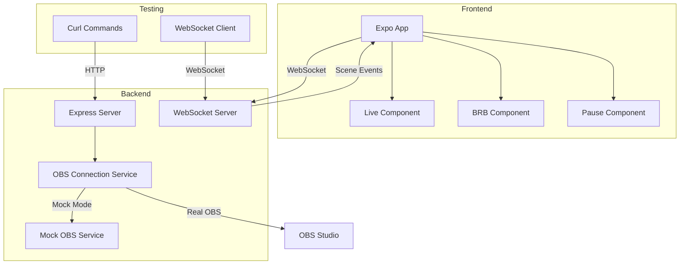

# OBS Backend Testing Summary

## Overview

This document provides a complete testing strategy for the OBS Backend Proxy, allowing you to test scene changes locally without requiring OBS Studio. The solution includes a mock mode implementation and comprehensive testing procedures.

## Files Created

1. **TESTING_PLAN.md** - Comprehensive testing plan with API endpoints and workflow
2. **MOCK_IMPLEMENTATION_GUIDE.md** - Step-by-step guide to implement mock mode
3. **CURL_COMMANDS.md** - Quick reference for all curl commands
4. **FRONTEND_INTEGRATION_GUIDE.md** - Complete frontend integration guide

## Quick Start Guide

### 1. Setup Mock Mode (One-time Setup)

Add mock mode to your `.env` file:

```bash
PORT=3001
OBS_WS_HOST=ws://127.0.0.1:4456
OBS_WS_PASSWORD=smederevo026
MOCK_MODE=true
```

### 2. Start the Backend Server

```bash
cd backend_proxy_obs_helper
npm run dev
```

### 3. Test Scene Changes

Open a new terminal and run these commands:

```bash
# Connect to mock OBS
curl -X POST http://localhost:3001/api/obs/connect \
  -H "Content-Type: application/json" \
  -d '{}'

# Change to Live scene
curl -X POST http://localhost:3001/api/obs/scene/change \
  -H "Content-Type: application/json" \
  -d '{"sceneName": "Live"}'

# Change to BRB scene
curl -X POST http://localhost:3001/api/obs/scene/change \
  -H "Content-Type: application/json" \
  -d '{"sceneName": "BRB"}'

# Change to Pause scene
curl -X POST http://localhost:3001/api/obs/scene/change \
  -H "Content-Type: application/json" \
  -d '{"sceneName": "Pause"}'
```

### 4. Test WebSocket Events

In another terminal:

```bash
wscat -c ws://localhost:3001
```

You should see scene change events when you execute the curl commands above.

## Architecture Diagram



## Testing Workflow

### Phase 1: Backend Testing

1. **Start Backend Server**

   ```bash
   npm run dev
   ```

2. **Test Health Endpoint**

   ```bash
   curl -X GET http://localhost:3001/api/health
   ```

3. **Connect to Mock OBS**

   ```bash
   curl -X POST http://localhost:3001/api/obs/connect \
     -H "Content-Type: application/json" \
     -d '{}'
   ```

4. **Test Scene Changes**

   - Live scene
   - BRB scene
   - Pause scene

5. **Verify WebSocket Events**
   ```bash
   wscat -c ws://localhost:3001
   ```

### Phase 2: Frontend Integration

1. **Implement WebSocket Service** (see FRONTEND_INTEGRATION_GUIDE.md)
2. **Add Scene Manager** for state management
3. **Create React Hook** for scene updates
4. **Update App Component** to render scenes based on events
5. **Test Integration** with curl commands

### Phase 3: End-to-End Testing

1. **Start Backend** (with mock mode)
2. **Start Frontend** (Expo app)
3. **Connect WebSocket** from frontend
4. **Send Scene Changes** via curl
5. **Verify Frontend Updates** in real-time

## Key Features Implemented

### Mock Mode Benefits

1. **No OBS Dependency**: Test without OBS Studio
2. **Consistent Behavior**: Predictable responses
3. **Fast Testing**: No connection delays
4. **CI/CD Ready**: Can be used in automated testing

### Scene Management

1. **Three Scenes**: Live, BRB, Pause
2. **Real-time Updates**: WebSocket events
3. **State Tracking**: Current and previous scenes
4. **Error Handling**: Invalid scene names

### WebSocket Events

1. **Connection Status**: Backend connection state
2. **Scene Changes**: Real-time scene updates
3. **Error Events**: Connection and OBS errors
4. **Automatic Reconnection**: Handles disconnections

## Troubleshooting

### Common Issues

1. **Port Already in Use**

   - Change PORT in .env file
   - Kill existing processes: `lsof -ti:3001 | xargs kill`

2. **WebSocket Connection Fails**

   - Check if backend is running
   - Verify port number
   - Check firewall settings

3. **Scene Changes Not Working**

   - Ensure OBS is connected first
   - Check scene names match exactly
   - Verify mock mode is enabled

4. **Frontend Not Updating**
   - Check WebSocket connection
   - Verify event listeners
   - Check React state updates

### Debug Commands

```bash
# Check backend logs
npm run dev

# Test WebSocket directly
wscat -c ws://localhost:3001

# Check API responses with verbose output
curl -v -X GET http://localhost:3001/api/health

# Test with different scene names
curl -X POST http://localhost:3001/api/obs/scene/change \
  -H "Content-Type: application/json" \
  -d '{"sceneName": "TestScene"}'
```

## Next Steps

### For Testing

1. **Implement Mock Mode** following MOCK_IMPLEMENTATION_GUIDE.md
2. **Run Test Suite** using commands from CURL_COMMANDS.md
3. **Verify WebSocket Events** with wscat
4. **Test Frontend Integration** using FRONTEND_INTEGRATION_GUIDE.md

### For Production

1. **Switch to Real OBS** by setting `MOCK_MODE=false`
2. **Configure OBS Studio** with WebSocket server
3. **Update Production URLs** in frontend
4. **Add Authentication** if needed
5. **Implement Error Handling** for production scenarios

## Performance Considerations

1. **WebSocket Connections**: Limit concurrent connections
2. **Scene Change Frequency**: Implement debouncing if needed
3. **Memory Usage**: Monitor WebSocket client connections
4. **Error Recovery**: Implement robust reconnection logic

## Security Notes

1. **CORS Configuration**: Update allowed origins in production
2. **WebSocket Security**: Use WSS in production
3. **API Authentication**: Add authentication if required
4. **Input Validation**: Validate scene names and parameters

## Conclusion

This testing setup provides a complete solution for testing OBS scene changes without requiring OBS Studio. The mock mode allows for rapid development and testing, while the real mode provides full OBS integration when needed.

The architecture is designed to be:

- **Flexible**: Easy to switch between mock and real modes
- **Scalable**: Can handle multiple WebSocket clients
- **Reliable**: Includes error handling and reconnection logic
- **Testable**: Comprehensive testing with curl commands

You can now test the complete flow from backend API calls to frontend UI updates, ensuring your scene switching functionality works correctly before deploying with real OBS Studio.
